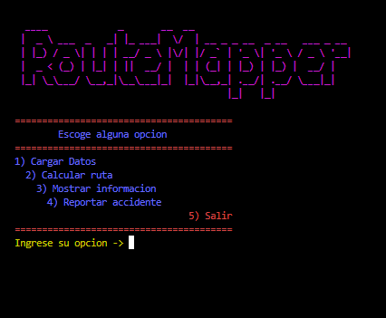
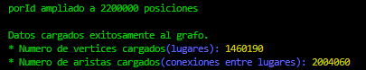
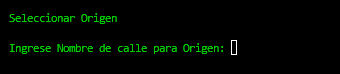
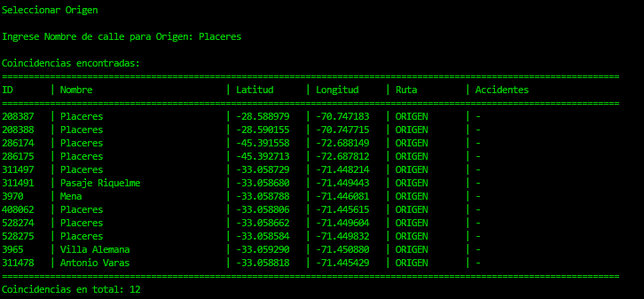
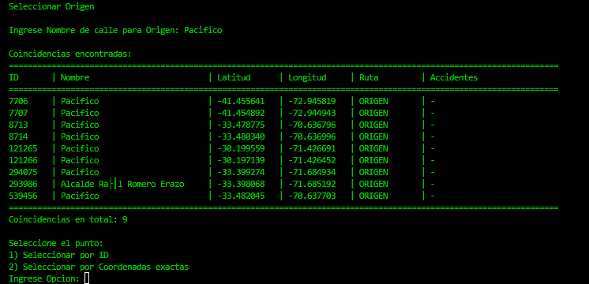

# ROUTEMAPPER


ROUTEMAPPER utiliza datos reales obtenidos desde OpenStreetMap para modelar la red vial de Chile, sobre la cual se ejecutan algoritmos de búsqueda y optimización de rutas.


## Fuente de datos


Los datos geográficos utilizados por el proyecto provienen de Geofabrik:


🔗 https://download.geofabrik.de/south-america/chile.html

Para ser mas especifico, en el sig link se encuentra la descarga directa de la base de datos a procesar:

🔗 https://download.geofabrik.de/south-america/chile-latest-free.gpkg.zip


## Dependencias


El proyecto utiliza **SQLite3** para consultar la información almacenada en la base de datos geográfica ubicada en el directorio `data/`.


### Descargar SQLite3


Para Windows, descargar SQLite3 desde su página oficial:


🔗 https://sqlite.org/download.html


Versión utilizada:


```

sqlite-amalgamation-3530200.zip

```


## Configuración inicial


Debido al tamaño del archivo `chile.gpkg`, este no pudo ser incluido en el repositorio mediante GitHub.


Por lo tanto, el usuario deberá descargarlo manualmente y copiarlo dentro del directorio:


```text

data/

```


## Estructura de la base de datos


La base de datos contiene múltiples tablas de interés para el proyecto.


### `gis_osm_roads_free`


Contiene aproximadamente **1.001.470 segmentos de vía**.


Campos relevantes:


| Campo | Descripción |

|---------|-------------|

| `fid` | Identificador interno |

| `geom` | Geometría tipo LINESTRING |

| `osm_id` | Identificador original de OpenStreetMap |

| `fclass` | Tipo de vía (`primary`, `secondary`, `residential`, etc.) |

| `name` | Nombre de la calle |

| `ref` | Referencia de carretera |

| `oneway` | Indica si la vía es de sentido único |

| `maxspeed` | Velocidad máxima permitida |


> **Nota:** La información proviene de OpenStreetMap, por lo que no se garantiza una cobertura o precisión absoluta en todas las zonas del país.


## Estructuras de datos utilizadas


Las principales estructuras de datos implementadas son:


| TDA | Uso |

|------|------|

| Grafo | Representación principal de la red vial |

| Mapa (Hash Table) | Búsqueda rápida de nodos por ID |

| Lista | Almacenamiento dinámico de colecciones |

| Heap | Implementación del algoritmo de Dijkstra |


## Compilación


Compilar el proyecto con:


```bash
COMANDO: gcc ROUTEMAPPER.c tdas/extra.c tdas/heap.c tdas/list.c tdas/hashmap.c libSqlite3/sqlite3.c -o ROUTEMAPPER -lm
```

Ejecutar el proyecto desde la terminal con:


```bash
COMANDO: ./ROUTEMAPPER.exe
```


## EXPLICACION DE USO:

Una vez ya descargado la base de datos (chile.gpkg) y guardado en su carpeta correspondiente dentro del proyecto (data/), de manera que quede asi (data/chile.gpkg), ya podemos compilar este proyecto para luego ser ejecutado (como se indico en los pasos anteriores).

Una vez abierto, veras la siguiente interfaz o menu:




Donde primero deberas de digitar en la terminal la opcion numero (1), la cual carga la informacion necesaria de la base de datos, dandonos un pequeño informe con el total de datos cargados.




Despues de cargar la informacion, ya podremos hacer consulta de rutas; atraves de la opcion numero (2) "Calcular ruta", al digitalizar el numero (2) en la terminal, saldra el siguiente submenu:



Donde debera de ingresar el nombre de la calle de origen:

### EJEMPLO:

```bash
Ingrese Nombre de calle para Origen: Pacifico
```


De modo que quede asi:



Posterior a esto, saldra el siguiente submenu con informacion de; Coincidencias de calles encontradas con respecto al nombre que ingreso:



En el cual tendra dos opciones a elegir:
1) para: Seleccionar por ID
2) para: Seleccionar por Coordenadas exactas

Usted debera de elegir la opcion que mas le plasca

### EJEMPLO:
Ingrese ID: 7706

Posterior a esto, debera de ingresar el nombre de la calle para destino

### EJEMPLO:
Ingrese Nombre de calle para Destino: Libertad


Ahora debera de volver a contestar si desea buscar el punto (pero ahora de destino), en ID o COORDENADAS, en este ejemplo ahora se seleccionara la opcion 2) (coordenadas), donde debera de ingresar la longitud y latitud de donde se encuentra la calle de destino a buscar

### EJEMPLO:
Ingrese Nombre de calle para Destino: Libertad


### APORTE DE CADA INTEGRANTE EN EL PROYECTO:

## Roberto Osses:
- Participación en la planificación general del proyecto y definición de idea.
- Trabajo en la presentación.
- Trabajo en la redacción y organización del informe.
- Apoyo en el diseño del grafo como una estructura para representar la red vial.
- Apoyo en la creación de vértices a partir de coordenadas.
- Implementación de la función que trata los grados como radianes.
- Implementación de la función que calcula la distancia entre 2 puntos mediante la fórmula de Haversine.
- Apoyo en la función que se encarga de guardar los datos dentro del grafo.
- Organización como equipo y planificación de futuras tareas.
- Apoyo en la prueba final del programa.

## Jhon Veliz:
- Participación en la planificación general del proyecto y definición de idea.
- Trabajo en la presentación.
- Trabajo en la redacción y organización del informe.
- Investigación del mapa de Chile, exportando como GeoPackage.
- Implementación de la carga de datos mediante SQLite.
- Extracción de las rutas de la tabla obtenida en OpenStreetMap.
- Trabajo en conjunto para la funciones creación de vértices y cálculo de distancias e inserción de conexiones hacia el grafo.
- Apoyo en la integración del HashMap como índice de coordenada para evitar vértices duplicados.
- Apoyo en la prueba final del programa.

## Martin Astorga:
- Participación en la planificación general del proyecto y definición de idea.
- Revisión de coherencia entre código, documentación y exposición.
- Trabajo por implementar principalmente “cálculo de ruta”, selección de origen y destino, validación de entrada de usuario y visualización en consola en la función “mostrar información”,“reportar accidentes”.
- Trabajo en la redacción y organización del informe.
- Trabajo en la presentación.
- Documentación de las nuevas funcionalidades implementadas.
- Apoyo en la prueba final del programa.

## Diego Rojas:
- Participación en la planificación general del proyecto y definición de idea.
- Trabajo en la presentación.
- Trabajo en la redacción y organización del informe.
- Trabajo por implementar principalmente “cálculo de ruta”, selección de origen y destino, validación de entrada de usuario y visualización en consola en la función “mostrar información, “reportar accidentes”.
- Apoyo pendiente en la integración del heap como cola de prioridad para Dijkstra.
- Documentación de las nuevas funcionalidades implementadas.
- Apoyo en la prueba final del programa.